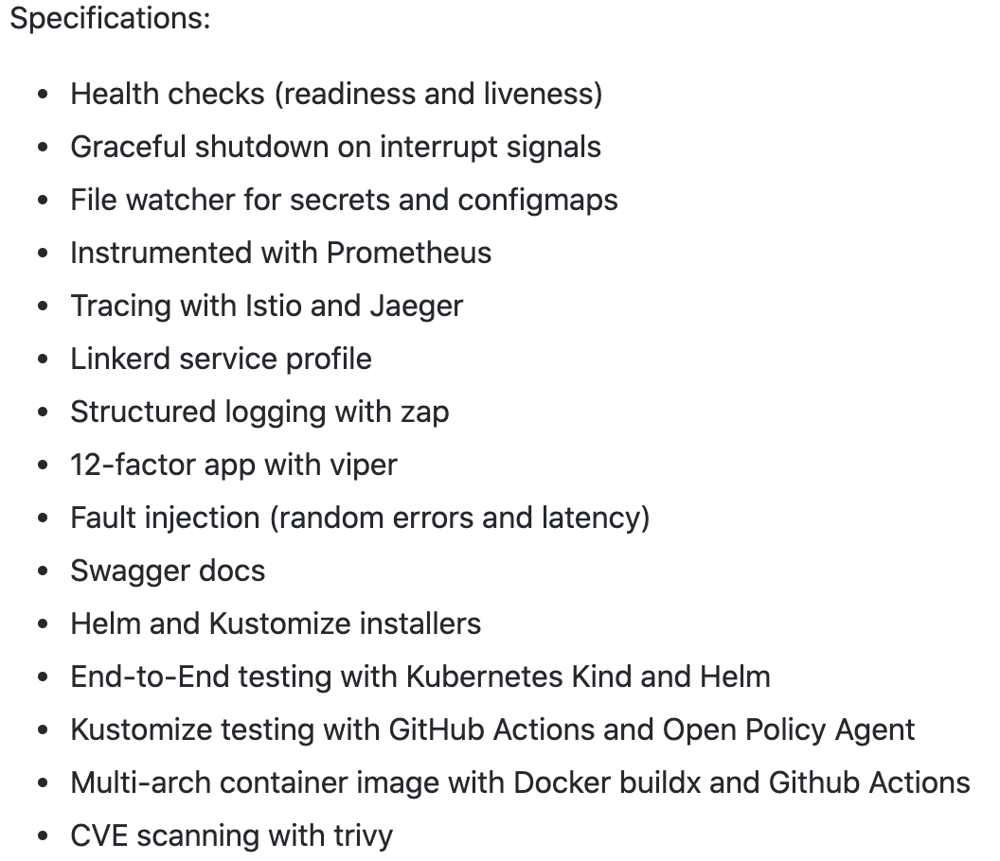
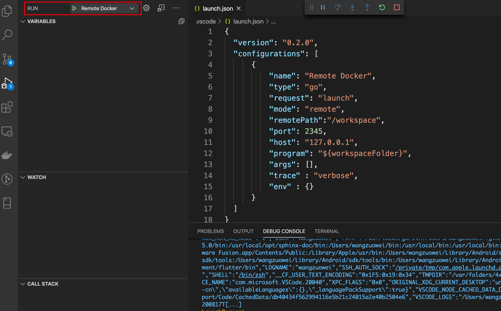
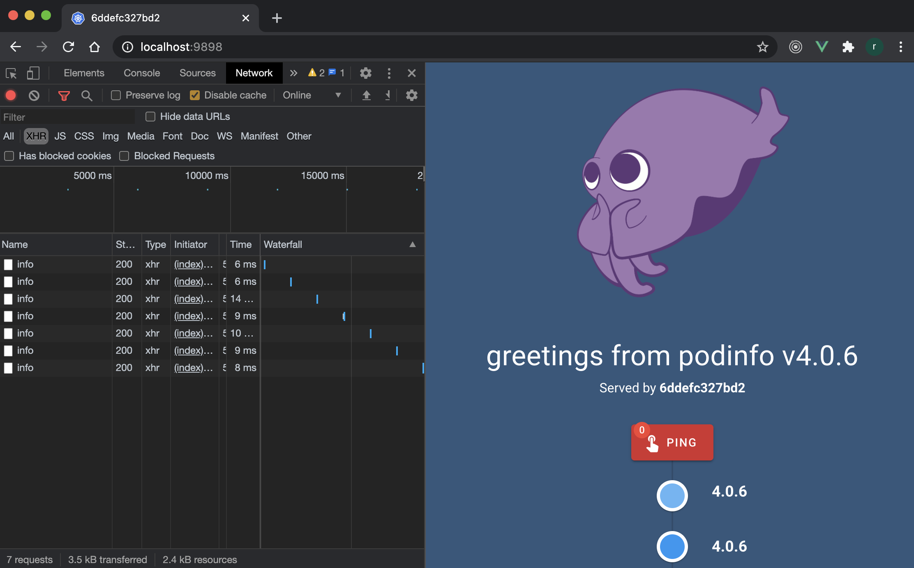
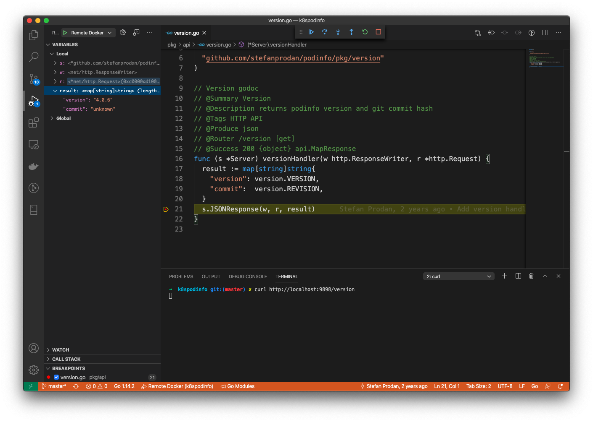

# 大前端时代，使用容器探索开源的 Golang 微服务模板项目

## 背景介绍

大前端时代，云原生时代，BFF Or BFF Microservices 基础设施层的构建不一定会由 NodeJS Or Deno 主导，我觉得 Golang 也会是一种不错的选择。至少笔者大前端团队在探索和实践。

基于 Kubernetes 的 GitOps 持续交付方式也将会成为大前端基础设施方向之一。

## 项目介绍

官方 Github: [Podinfo](https://github.com/stefanprodan/podinfo)

[笔者修改过的 Podinfo 项目地址](https://github.com/Hacker-Linner/podinfo)

Podinfo 是一个用 Go 制作的小型 web 应用程序，它展示了在 Kubernetes 中运行微服务的最佳实践。

它已实现的技术指标(截选自官方 [README.md](https://github.com/stefanprodan/podinfo) )：



里面每一项技术指标的实现方式，其实都可以拿出来单独讲好久，相关理论也有好多。

这里我只是讲针对这个项目，我们该如何使用 Docker 容器去探索它。

## 构建容器调试环境

### IDE

VSCode + [golang/vscode-go](https://github.com/golang/vscode-go)

### Go 国内加速镜像

[Go 国内加速镜像](https://learnku.com/go/wikis/38122)

### 编写 Dockerfile.dev 文件

```yaml
FROM golang:1.14

WORKDIR /workspace

# copy modules manifests
COPY go.mod go.mod
COPY go.sum go.sum

# 阿里云
RUN go env -w GO111MODULE=on
RUN go env -w GOPROXY=https://mirrors.aliyun.com/goproxy/,direct

# cache modules
RUN go mod download
RUN go get github.com/go-delve/delve/cmd/dlv
```

### 构建 Image

```sh 
docker build -f Dockerfile.dev -t podinfo:dev .
```

### 编写 docker-compose.yaml

```yaml
version: "3.4"
services:
  golang:
    image: podinfo:dev
    command: >
      bash -c "ls -la
      && dlv debug /workspace/cmd/podinfo --headless --log -l 0.0.0.0:2345 --api-version=2"
    volumes:
    - ./:/workspace
    ports:
      - 9898:9898
      - 2345:2345
    security_opt:
      - "seccomp:unconfined"
```

### 配置 `.vscode` 的 `launch.json`

```json
{
  "version": "0.2.0",
  "configurations": [
      {
          "name": "Remote Docker",
          "type": "go",
          "request": "launch",
          "mode": "remote",
          "remotePath":"/workspace",
          "port": 2345,
          "host": "127.0.0.1",
          "program": "${workspaceFolder}",
          "args": [],
          "trace" : "verbose",
          "env" : {}
      }
  ]
}
```

## 开始探索

### docker compose 一键启动

```sh
docker-compose up
```

### Run Remote Docker



### 查看首页

[http://localhost:9898](http://localhost:9898)



### 查看给 Prometheus 的 `metrics` API

[http://localhost:9898/metrics](http://localhost:9898/metrics)


### 下断点，发请求调试

[http://localhost:9898/api/info](http://localhost:9898/api/info)



## Refs

### 12factor

[The Twelve-Factor App](https://12factor.net/zh_cn/)

[笔者修改过的 Podinfo 项目地址](https://github.com/Hacker-Linner/podinfo)

本文抛转引玉，后文待续……