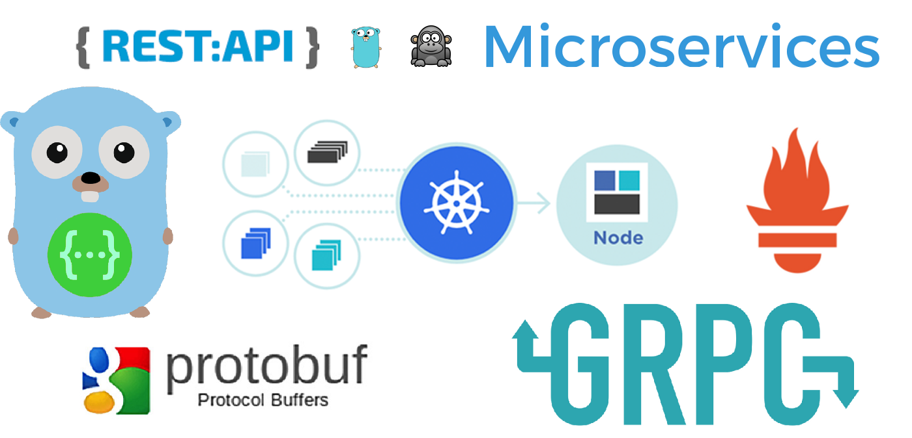
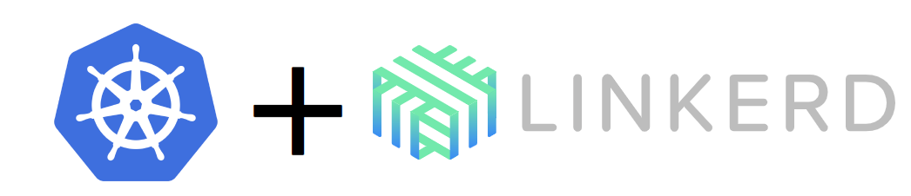
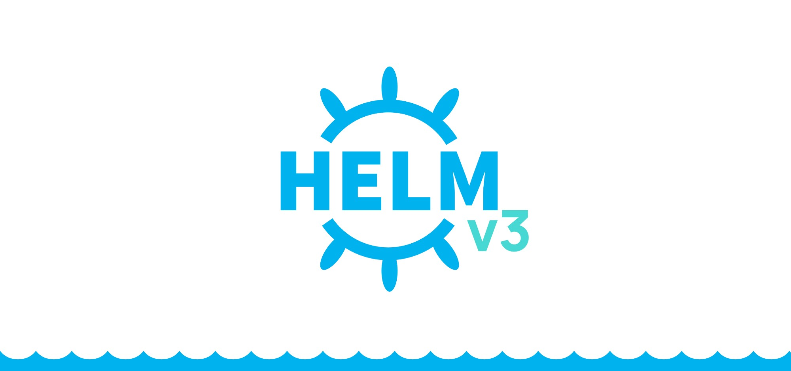
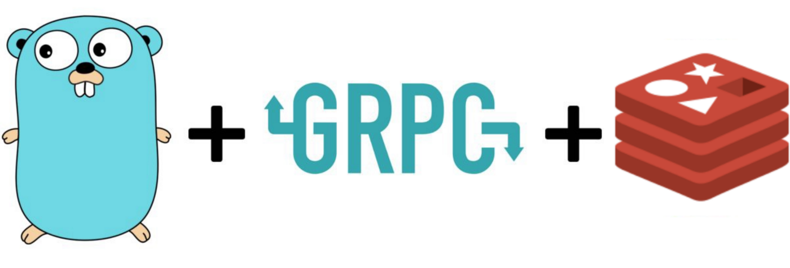
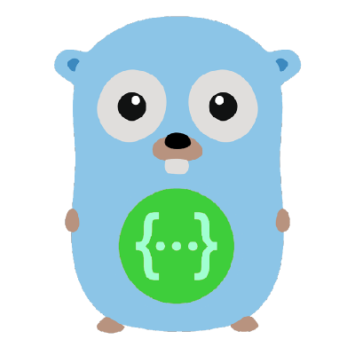

# 大前端时代，FEer 聊 12factor-App Go 微服务项目 Podinfo 之开篇



## 项目介绍

Github: [Podinfo](https://github.com/stefanprodan/podinfo)

[笔者修改过的 Podinfo 项目地址](https://github.com/Hacker-Linner/podinfo)

Podinfo 是一个用 Go 制作的微小型 web 应用程序，它展示了在 Kubernetes 中运行微服务的最佳实践。

Podinfo 也是一个标准的 `The Twelve-Factor App`

### 什么是 The Twelve-Factor App ？

[The Twelve-Factor App](https://12factor.net/zh_cn/)

官方简介：

如今，软件通常会作为一种服务来交付，它们被称为网络应用程序，或软件即服务（SaaS）。12-Factor 为构建如下的 SaaS 应用提供了方法论：

  * 使用标准化流程自动配置，从而使新的开发者花费最少的学习成本加入这个项目。
  * 和操作系统之间尽可能的划清界限，在各个系统中提供最大的可移植性。
  * 适合部署在现代的云计算平台，从而在服务器和系统管理方面节省资源。
  * 将开发环境和生产环境的差异降至最低，并使用持续交付实施敏捷开发。
  * 可以在工具、架构和开发流程不发生明显变化的前提下实现扩展。

这套理论适用于任意语言和后端服务（数据库、消息队列、缓存等）开发的应用程序。

## 容器化调试与探索

笔者的上篇文章：[大前端时代，使用容器探索开源的 Golang 微服务模板项目|🏆 技术专题第二期征文](https://juejin.im/post/6862964394834264072)

## 从 Helm Charts 开始

[Podinfo//Charts](https://github.com/stefanprodan/podinfo/tree/master/charts/podinfo)

因为 Podinfo 是一个云原生项目，所以它的 Helm Charts 的编写还是值得借鉴和学习的。

当然这里需要你有一些 K8S 的经验。

### Helm 安装 Podinfo

```console
$ helm repo add podinfo https://stefanprodan.github.io/podinfo

$ helm upgrade -i my-release podinfo/podinfo 
```

### Helm 卸载 Podinfo

```console
$ helm delete my-release
```

### 看配置，了解 PodInfo 是如何上云的？

非常直接借鉴

参数 | 默认值 | 描述
--- | --- | ---
`replicaCount` | `1` | 期望的 K8S Pods(也就是代码在集群中部署几个实例)
`logLevel` | `info` | 日志级别: `debug`, `info`, `warn`, `error`, `flat` or `panic`
`backend` | `None` | 需要调用的后端或者是第三方的 URL（如 Java 后端）
`backends` | `[]` | 需要调用的后端或者是第三方的 URLs（如 Java 后端）
`cache` | `None` | Redis 地址 `<host>:<port>`
`redis.enabled` | `false` | 是否开启 Redis 缓存
`ui.color` | `#34577c` |  UI 颜色
`ui.message` | `None` |  UI 问候消息
`ui.logo` | `None` |  UI logo
`faults.delay` | `false` | 随机 HTTP 响应延迟 0 到 5 秒
`faults.error` | `false` | 1/3 概率的随机 HTTP 响应错误
`faults.unhealthy` | `false` | 设置后，永远不会达到健康状态
`faults.unready` | `false` | 当设置时，永远不会达到就绪状态
`faults.testFail` | `false` | 当设置时，helm 测试总是失败
`faults.testTimeout` | `false` | 当设置时，helm 测试总是包括超时
`h2c.enabled` | `false` | 允许升级到 h2c
`image.repository` | `stefanprodan/podinfo` | 镜像库（地址）
`image.tag` | `<VERSION>` | 镜像 tag
`image.pullPolicy` | `IfNotPresent` | Image 拉取策略
`service.enabled` | `true` | 创建 Kubernetes 服务，使用 [Flagger](https://flagger.app) 时应禁用
`service.type` | `ClusterIP` | Kubernetes Service 类型
`service.metricsPort` | `9797` | Prometheus 指标端点端口
`service.httpPort` | `9898` | Container HTTP 端口
`service.externalPort` | `9898` | ClusterIP HTTP 端口
`service.grpcPort` | `9999` | ClusterIP gPRC 端口
`service.grpcService` | `podinfo` | gPRC service 名称
`service.nodePort` | `31198` | HTTP 端点的 NodePort
`hpa.enabled` | `false` | 启用 Kubernetes HPA（Pod 水平自动伸缩）
`hpa.maxReplicas` | `10` | Pods 最大数量
`hpa.cpu` | `None` | 每个 Pod 的目标CPU使用率
`hpa.memory` | `None` | 每个 Pod 的目标内存使用量
`hpa.requests` | `None` | 每个 Pod 每秒目标 HTTP 请求
`serviceAccount.enabled` | `false` | 是否应创建 service account
`serviceAccount.name` | `None` | 要使用的 service account 的名称，如果未设置且 enabled 为true，则使用 fullname 生成名称
`linkerd.profile.enabled` | `false` | 创建 Linkerd 服务配置文件
`serviceMonitor.enabled` | `false` | 是否应创建 Prometheus Operator 服务监视器
`serviceMonitor.interval` | `15s` | Prometheus 抓取间隔
`ingress.enabled` | `false` | 启用 Ingress
`ingress.annotations` | `{}` | Ingress 注解
`ingress.path` | `/*` | Ingress 路径
`ingress.hosts` | `[]` | Ingress 接受的 hosts
`ingress.tls` | `[]` | Ingress TLS 配置
`resources.requests.cpu` | `1m` | Pod CPU 请求
`resources.requests.memory` | `16Mi` | Pod 内存 请求
`resources.limits.cpu` | `None` | Pod CPU 限制
`resources.limits.memory` | `None` | Pod memory 限制
`nodeSelector` | `{}` | Pod 分配的集群节点标签（说白了就是固定部署到你指定的机器）
`tolerations` | `[]` | 可容忍的节点污点列表
`affinity` | `None` | Node/pod 亲和力
`podAnnotations` | `{}` | Pod 注解

## 从 Makefile 开始

### 查看 run 指令

```sh
run:
	go run -ldflags "-s -w -X github.com/stefanprodan/podinfo/pkg/version.REVISION=$(GIT_COMMIT)" cmd/podinfo/* \
	--level=debug --grpc-port=9999 --backend-url=https://httpbin.org/status/401 --backend-url=https://httpbin.org/status/500 \
	--ui-logo=https://raw.githubusercontent.com/stefanprodan/podinfo/gh-pages/cuddle_clap.gif $(EXTRA_RUN_ARGS)
```

很清晰的知道入口在 `cmd/podinfo/main.go`

### 查看 main.go

探索 `cmd/podinfo/main.go`

通过注释，我们很清晰的看到了如下流程：

* flags definition（命令行参数定义）
* parse flags（转换命令行参数）
* bind flags and environment variables（绑定参数和环境变量）
* load config from file（从文件中加载配置）
* configure logging（配置日志）
* start stress tests if any (启动压力测试，如果有的话)
* validate port（验证端口）
* validate random delay options（验证随机延迟选项）
* load gRPC server config（加载 gRPC server 配置）
* start gRPC server（启动 gRPC server）
* load HTTP server config（加载 HTTP server 配置）
* log version and port（打印版本和端口）
* start HTTP server（启动 HTTP server）

同样顺着进入 `API Server`(pkg/api/server.go)，同时注释也比较清晰。

很多代码细节，大家可以 google（一杯咖啡，一颗爱学习的心）。

## 运转 Podinfo 涉及到的相关项目

### Kubernetes

[Kubernetes 官网](https://kubernetes.io/zh/)


Kubernetes 是一个开源的容器编排引擎，用来对容器化应用进行自动化部署、 扩缩和管理。该项目托管在 [CNCF](https://www.cncf.io/)。

### Linkerd

[Linkerd 官网](https://linkerd.io/)



Linkerd 是一个提供弹性云端原生应用服务网格的开源项目。其核心是一个透明代理，可以用它来实现一个专用的基础设施层以提供服务间的通信，进而为软件应用提供服务发现、路由、错误处理以及服务可见性等功能，而无需侵入应用内部本身的实现。

### Prometheus

[Prometheus 官网](https://prometheus.io/)

[prometheus/client_golang](https://github.com/prometheus/client_golang)


[Prometheus](https://github.com/prometheus) 是由前 Google 工程师从 2012 年开始在 [Soundcloud](http://soundcloud.com/) 以开源软件的形式进行研发的系统监控和告警工具包，自此以后，许多公司和组织都采用了 Prometheus 作为监控告警工具。

### Helm

[Helm 官网](https://helm.sh/)



伴随着云原生技术的迅速崛起，Kubernetes 已经成为事实上应用容器化平台的标准，成为了云原生领域的一等公民。它以一种声明式的容器编排与管理体系，让软件交付变得越来越标准化。具体来说，Kubernetes 提供了统一模式的 API，能以 YAML 格式的文件定义 Kubernetes 集群内的资源。

### Kustomize

[Kustomize 官网](https://kustomize.io/)


Kustomize 是 Kubernetes 原生的配置管理，以无模板方式来定制应用的配置。Kustomize 使用 k8s 原生概念帮助创建并复用资源配置(YAML)，允许用户以一个应用描述文件 （YAML 文件）为基础（Base YAML），然后通过 Overlay 的方式生成最终部署应用所需的描述文件。

### Viper

[viper](https://github.com/spf13/viper)


Golang 配置管理解决方案。可以从 JSON、TOML、YAML、HCL、envfile和Java properties格式的配置文件读取配置信息。

### Pflag

[pflag](https://github.com/spf13/pflag)

Golang 第三方处理命令行参数的库。pflag 包的设计目的就是替代标准库中的 flag 包，因此它具有更强大的功能并且与标准的兼容性更好。

### Zap

[zap](https://github.com/uber-go/zap)

⚡ Golang 高性能日志库，uber 开源。

### Mux

[gorilla/mux](https://github.com/gorilla/mux)


gorilla/mux 是一个强大的 URL 路由器和 golang 调度程序。它实现了请求路由器和调度程序，用于将传入请求与其各自的处理程序进行匹配。

### gRPC

[gRPC-Go](https://github.com/grpc/grpc-go)

gRPC 是一个高性能、开源和通用的 RPC 框架，面向移动和 HTTP/2 设计。目前提供 C、Java 和 Go 语言版本，分别是：grpc, grpc-java, grpc-go. 其中 C 版本支持 C, C++, Node.js, Python, Ruby, Objective-C, PHP 和 C# 支持。

### Redigo

[Redigo](https://github.com/gomodule/redigo)



Redis golang 客户端。

### Swaggo

[swag](https://github.com/swaggo/swag)



Swag 将 Go 的注释转换为 Swagger2.0 文档。

### Fsnotify

[fsnotify](https://github.com/fsnotify)

Go 跨平台文件系统监控工具


## 参考 & 感谢

* [kustomize 最简实践](https://zhuanlan.zhihu.com/p/92153378)
* [YAML 模版老去？Helm Chart 或将应用分发事实标准](https://www.infoq.cn/article/dWc0IPNGUOGQ4KBAp*9G)
* [Golang : pflag 包简介](https://www.cnblogs.com/sparkdev/p/10833186.html)
* [Go语言配置管理神器——Viper中文教程](https://www.liwenzhou.com/posts/Go/viper_tutorial)
* [在Go语言项目中使用Zap日志库](https://www.liwenzhou.com/posts/Go/zap/)
* [golang常用库：gorilla/mux,http路由库使用](https://www.cnblogs.com/jiujuan/p/12768907.html)
* [gRPC 官方文档中文版](http://doc.oschina.net/grpc)
* [linkerd官方文档中文版](https://doczhcn.gitbook.io/linkerd/)
* [用Golang构建gRPC服务](https://juejin.im/post/6844903957672755214)
* [Go http2 和 h2c](https://colobu.com/2018/09/06/Go-http2-%E5%92%8C-h2c/)
* [[Tutorial, Part 1] How to develop Go gRPC microservice with HTTP/REST endpoint, middleware, Kubernetes deployment, etc.](https://medium.com/@amsokol.com/tutorial-how-to-develop-go-grpc-microservice-with-http-rest-endpoint-middleware-kubernetes-daebb36a97e9)
* [[Tutorial, Part 2] How to develop Go gRPC microservice with HTTP/REST endpoint, middleware, Kubernetes deployment, etc.](https://medium.com/@amsokol.com/tutorial-how-to-develop-go-grpc-microservice-with-http-rest-endpoint-middleware-kubernetes-af1fff81aeb2)
* [[Tutorial, Part 3] How to develop Go gRPC microservice with HTTP/REST endpoint, middleware, Kubernetes deployment, etc.](https://medium.com/@amsokol.com/tutorial-part-3-how-to-develop-go-grpc-microservice-with-http-rest-endpoint-middleware-739aac8f1d7e)

未完待续……

[🏆 技术专题第二期 | 我与 Go 的那些事......](https://juejin.im/post/6859784103621820429)
