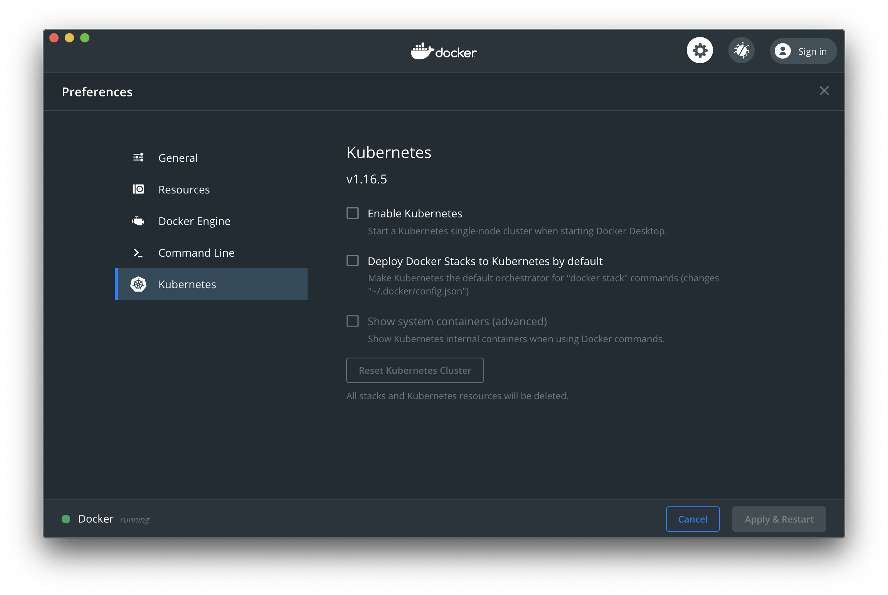

# 大前端时代，FEer 聊 12factor-App Go 微服务项目 Podinfo 之 K8S 从 0 到 1 自建实战篇

## 背景

### 云原生

“未来的软件一定是生长于云上的”这是云原生理念的最核心假设。而所谓“云原生”，实际上就是在定义一条能够让应用最大程度利用云的能力、发挥云的价值的最佳路径。在这条路径上，脱离了“应用”这个载体，“云原生”就无从谈起；容器技术，则是将这个理念落地、将软件交付的革命持续进行下去的重要手段之一。

Kubernetes 项目，则是整个“云原生”理念落地的核心与关键所在。它正在迅速成为连通“云”与“应用”的高速公路，以标准、高效的方式将“应用”快速交付到世界上任何一个位置。如今 “云原生应用交付”，已经成为了云计算市场上最热门的技术关键词之一。

### 云原生的愿景

软件从诞生起就生在云上、长在云上的、全新的软件开发、发布和运维模式。

### 这是一个系列
[大前端时代，使用容器探索开源的 Golang 微服务模板项目](https://juejin.im/post/6862964394834264072)

[大前端时代，FEer 聊 12factor-App Go 微服务项目 Podinfo 之开篇](https://juejin.im/post/6863349383438860302)

### 项目 Github

[Podinfo](https://github.com/stefanprodan/podinfo)

[笔者修改过的 Podinfo 项目地址](https://github.com/Hacker-Linner/podinfo)

### 为什么要用 Kubernetes？

[灵魂拷问，上 Kubernetes 有什么业务价值？](https://www.cnblogs.com/alisystemsoftware/p/13470128.html)

[《基于 Kubernetes 与 OAM 构建统一、标准化的应用管理平台》视频](https://www.bilibili.com/video/BV1Dv411v7P4/)

## Vultr 上自建 K8S

我们想要一个和生产差不太多的环境，我们这里就不用本地的了。

### 本地开启 Kubernetes

你本地机器安装好 Docker Desktop，开启 K8S 是一件非常简单的事情。



### 充 10 美元送 100 美元

最近 Vultr 在搞活动，所以我们可以撸一把羊毛 [充 $10 送 $100](https://www.vultr.com/?ref=8663678-6G)。

大家按照注册激活就好。[为少](https://hacker-linner.com) 注册时相关截图如下（可以直接用支付宝支付）：


### 购买机器

这里，[为少](https://hacker-linner.com) 直接新建三台 4 核 8 G 的 CentOS 7 的机器：


## 搭建 1Master + 2Worker K8S 集群

假设你的集群是如下：
hostname | ip 
--- | --- 
k8s-master-1| 172.18.37.1
k8s-worker-1| 172.18.37.2
k8s-worker-2| 172.18.37.3

### Master 节点部署 K8S

登录 `k8s-master-1`

如果新建机器的时候没有设置 `hostname`，一定要 `set-hostname`

```sh
# 我这里名字是 k8s-master-1
hostnamectl  set-hostname  k8s-master-1
```

设置 `etc/hosts`

```sh
echo "172.18.37.1   $(hostname)" >> /etc/hosts
echo "127.0.0.1   $(hostname)" >> /etc/hosts
echo "172.18.37.2   k8s-worker-1" >> /etc/hosts
echo "172.18.37.3   k8s-worker-2" >> /etc/hosts
```

退出，重新登录，你会看到 `hostname` 已经变了：


接着按照执行如下命令即可：

```sh
yum install screen -y
screen -S K8S
# screen -R K8S
### Add yum-utils, if not installed already
yum -y update
yum install -y epel-release
yum install -y yum-utils device-mapper-persistent-data lvm2 net-tools conntrack-tools wget vim ntpdate libseccomp libtool-ltdl

### time
systemctl start chronyd.service && systemctl enable chronyd.service

### Disable Firewall
systemctl stop firewalld && systemctl disable firewalld

### Disable SELinux
setenforce 0
sed -i 's/^SELINUX=enforcing$/SELINUX=disabled/' /etc/selinux/config

### Disable Swap
sed -i '/swap/d' /etc/fstab
swapoff -a && sysctl -w vm.swappiness=0

cat <<EOF > /etc/sysctl.d/k8s.conf

net.ipv4.ip_forward = 1
net.bridge.bridge-nf-call-ip6tables = 1
net.bridge.bridge-nf-call-iptables = 1
net.ipv4.tcp_keepalive_time = 600
net.ipv4.tcp_keepalive_intvl = 30
net.ipv4.tcp_keepalive_probes = 10
EOF

### br_netfilter
modprobe br_netfilter
sysctl -p /etc/sysctl.d/k8s.conf
ls /proc/sys/net/bridge

### IPVS
cat > /etc/sysconfig/modules/ipvs.modules <<EOF

#!/bin/bash
modprobe -- ip_vs
modprobe -- ip_vs_rr
modprobe -- ip_vs_wrr
modprobe -- ip_vs_sh
modprobe -- nf_conntrack_ipv4

EOF

### ipvs.modules
chmod 755 /etc/sysconfig/modules/ipvs.modules
bash /etc/sysconfig/modules/ipvs.modules
lsmod | grep -e ip_vs -e nf_conntrack_ipv4

### ipset
yum install -y ipset

### security/limits
echo "* soft nofile 65536" >> /etc/security/limits.conf
echo "* hard nofile 65536" >> /etc/security/limits.conf
echo "* soft nproc 65536"  >> /etc/security/limits.conf
echo "* hard nproc 65536"  >> /etc/security/limits.conf
echo "* soft memlock  unlimited"  >> /etc/security/limits.conf
echo "* hard memlock  unlimited"  >> /etc/security/limits.conf

### Install Docker CE.
yum-config-manager --add-repo https://download.docker.com/linux/centos/docker-ce.repo
sudo yum -y install docker-ce-19.03.5

mkdir -p /etc/docker
cat > /etc/docker/daemon.json << EOF

{
  "exec-opts": ["native.cgroupdriver=systemd"],
  "registry-mirrors": [],
  "storage-driver": "overlay2",
  "storage-opts": [
    "overlay2.override_kernel_check=true"
  ],
  "log-driver": "json-file",
  "log-opts": {
    "max-size": "100m",
    "max-file":"5"
  },
  "insecure-registries": []
}

EOF

systemctl start docker && systemctl enable docker

### Install kubelet/kubectl/kubeadm
cat <<EOF > /etc/yum.repos.d/kubernetes.repo
[kubernetes]
name=Kubernetes
baseurl=https://packages.cloud.google.com/yum/repos/kubernetes-el7-x86_64
enabled=1
gpgcheck=1
repo_gpgcheck=1
gpgkey=https://packages.cloud.google.com/yum/doc/yum-key.gpg https://packages.cloud.google.com/yum/doc/rpm-package-key.gpg
EOF

yum install -y kubelet-1.16.9-0
yum install -y kubectl-1.16.9-0
yum install -y kubeadm-1.16.9-0

systemctl start kubelet && systemctl enable kubelet
```

初始化 `master` 节点，如下（注意 `advertiseAddress`，是你 `master` 节点的 IP `172.18.37.1`）：

```sh
cat > kubeadm-config.yaml << EOF

apiVersion: kubeadm.k8s.io/v1beta2
kind: InitConfiguration
localAPIEndpoint:
  advertiseAddress: 172.18.37.1
  bindPort: 6443
nodeRegistration:
  taints:
  - effect: PreferNoSchedule
    key: node-role.kubernetes.io/master
---
apiVersion: kubeadm.k8s.io/v1beta2
kind: ClusterConfiguration
imageRepository: k8s.gcr.io
kubernetesVersion: v1.16.3
networking:
  podSubnet: 10.244.0.0/16
---
apiVersion: kubeproxy.config.k8s.io/v1alpha1
kind: KubeProxyConfiguration
mode: ipvs

EOF

kubeadm init --config kubeadm-config.yaml

```

看到如下，说明 Kubernetes 控制平面初始化成功：

```sh
Your Kubernetes control-plane has initialized successfully!

To start using your cluster, you need to run the following as a regular user:

  mkdir -p $HOME/.kube
  sudo cp -i /etc/kubernetes/admin.conf $HOME/.kube/config
  sudo chown $(id -u):$(id -g) $HOME/.kube/config

You should now deploy a pod network to the cluster.
Run "kubectl apply -f [podnetwork].yaml" with one of the options listed at:
  https://kubernetes.io/docs/concepts/cluster-administration/addons/

Then you can join any number of worker nodes by running the following on each as root:

kubeadm join 172.18.37.1:6443 --token xm4kyl.xujcfy79p95cbsku \
    --discovery-token-ca-cert-hash sha256:d11201752c7b0d34593b41a4baa8a9431c6527718ad450c78775cb5e280a3e42
```

使用集群：

```sh
mkdir -p $HOME/.kube
sudo cp -i /etc/kubernetes/admin.conf $HOME/.kube/config
sudo chown $(id -u):$(id -g) $HOME/.kube/config
```

CNI 网络配置

```sh
cat > calico.yaml << EOF

---
# Source: calico/templates/calico-config.yaml
# This ConfigMap is used to configure a self-hosted Calico installation.
kind: ConfigMap
apiVersion: v1
metadata:
  name: calico-config
  namespace: kube-system
data:
  # Typha is disabled.
  typha_service_name: "none"
  # Configure the backend to use.
  calico_backend: "bird"

  # Configure the MTU to use
  veth_mtu: "1440"

  # The CNI network configuration to install on each node.  The special
  # values in this config will be automatically populated.
  cni_network_config: |-
    {
      "name": "k8s-pod-network",
      "cniVersion": "0.3.1",
      "plugins": [
        {
          "type": "calico",
          "log_level": "info",
          "datastore_type": "kubernetes",
          "nodename": "__KUBERNETES_NODE_NAME__",
          "mtu": __CNI_MTU__,
          "ipam": {
              "type": "calico-ipam"
          },
          "policy": {
              "type": "k8s"
          },
          "kubernetes": {
              "kubeconfig": "__KUBECONFIG_FILEPATH__"
          }
        },
        {
          "type": "portmap",
          "snat": true,
          "capabilities": {"portMappings": true}
        },
        {
          "type": "bandwidth",
          "capabilities": {"bandwidth": true}
        }
      ]
    }

---
# Source: calico/templates/kdd-crds.yaml

apiVersion: apiextensions.k8s.io/v1beta1
kind: CustomResourceDefinition
metadata:
  name: bgpconfigurations.crd.projectcalico.org
spec:
  scope: Cluster
  group: crd.projectcalico.org
  version: v1
  names:
    kind: BGPConfiguration
    plural: bgpconfigurations
    singular: bgpconfiguration

---
apiVersion: apiextensions.k8s.io/v1beta1
kind: CustomResourceDefinition
metadata:
  name: bgppeers.crd.projectcalico.org
spec:
  scope: Cluster
  group: crd.projectcalico.org
  version: v1
  names:
    kind: BGPPeer
    plural: bgppeers
    singular: bgppeer

---
apiVersion: apiextensions.k8s.io/v1beta1
kind: CustomResourceDefinition
metadata:
  name: blockaffinities.crd.projectcalico.org
spec:
  scope: Cluster
  group: crd.projectcalico.org
  version: v1
  names:
    kind: BlockAffinity
    plural: blockaffinities
    singular: blockaffinity

---
apiVersion: apiextensions.k8s.io/v1beta1
kind: CustomResourceDefinition
metadata:
  name: clusterinformations.crd.projectcalico.org
spec:
  scope: Cluster
  group: crd.projectcalico.org
  version: v1
  names:
    kind: ClusterInformation
    plural: clusterinformations
    singular: clusterinformation

---
apiVersion: apiextensions.k8s.io/v1beta1
kind: CustomResourceDefinition
metadata:
  name: felixconfigurations.crd.projectcalico.org
spec:
  scope: Cluster
  group: crd.projectcalico.org
  version: v1
  names:
    kind: FelixConfiguration
    plural: felixconfigurations
    singular: felixconfiguration

---
apiVersion: apiextensions.k8s.io/v1beta1
kind: CustomResourceDefinition
metadata:
  name: globalnetworkpolicies.crd.projectcalico.org
spec:
  scope: Cluster
  group: crd.projectcalico.org
  version: v1
  names:
    kind: GlobalNetworkPolicy
    plural: globalnetworkpolicies
    singular: globalnetworkpolicy

---
apiVersion: apiextensions.k8s.io/v1beta1
kind: CustomResourceDefinition
metadata:
  name: globalnetworksets.crd.projectcalico.org
spec:
  scope: Cluster
  group: crd.projectcalico.org
  version: v1
  names:
    kind: GlobalNetworkSet
    plural: globalnetworksets
    singular: globalnetworkset

---
apiVersion: apiextensions.k8s.io/v1beta1
kind: CustomResourceDefinition
metadata:
  name: hostendpoints.crd.projectcalico.org
spec:
  scope: Cluster
  group: crd.projectcalico.org
  version: v1
  names:
    kind: HostEndpoint
    plural: hostendpoints
    singular: hostendpoint

---
apiVersion: apiextensions.k8s.io/v1beta1
kind: CustomResourceDefinition
metadata:
  name: ipamblocks.crd.projectcalico.org
spec:
  scope: Cluster
  group: crd.projectcalico.org
  version: v1
  names:
    kind: IPAMBlock
    plural: ipamblocks
    singular: ipamblock

---
apiVersion: apiextensions.k8s.io/v1beta1
kind: CustomResourceDefinition
metadata:
  name: ipamconfigs.crd.projectcalico.org
spec:
  scope: Cluster
  group: crd.projectcalico.org
  version: v1
  names:
    kind: IPAMConfig
    plural: ipamconfigs
    singular: ipamconfig

---
apiVersion: apiextensions.k8s.io/v1beta1
kind: CustomResourceDefinition
metadata:
  name: ipamhandles.crd.projectcalico.org
spec:
  scope: Cluster
  group: crd.projectcalico.org
  version: v1
  names:
    kind: IPAMHandle
    plural: ipamhandles
    singular: ipamhandle

---
apiVersion: apiextensions.k8s.io/v1beta1
kind: CustomResourceDefinition
metadata:
  name: ippools.crd.projectcalico.org
spec:
  scope: Cluster
  group: crd.projectcalico.org
  version: v1
  names:
    kind: IPPool
    plural: ippools
    singular: ippool

---
apiVersion: apiextensions.k8s.io/v1beta1
kind: CustomResourceDefinition
metadata:
  name: networkpolicies.crd.projectcalico.org
spec:
  scope: Namespaced
  group: crd.projectcalico.org
  version: v1
  names:
    kind: NetworkPolicy
    plural: networkpolicies
    singular: networkpolicy

---
apiVersion: apiextensions.k8s.io/v1beta1
kind: CustomResourceDefinition
metadata:
  name: networksets.crd.projectcalico.org
spec:
  scope: Namespaced
  group: crd.projectcalico.org
  version: v1
  names:
    kind: NetworkSet
    plural: networksets
    singular: networkset

---
---
# Source: calico/templates/rbac.yaml

# Include a clusterrole for the kube-controllers component,
# and bind it to the calico-kube-controllers serviceaccount.
kind: ClusterRole
apiVersion: rbac.authorization.k8s.io/v1
metadata:
  name: calico-kube-controllers
rules:
  # Nodes are watched to monitor for deletions.
  - apiGroups: [""]
    resources:
      - nodes
    verbs:
      - watch
      - list
      - get
  # Pods are queried to check for existence.
  - apiGroups: [""]
    resources:
      - pods
    verbs:
      - get
  # IPAM resources are manipulated when nodes are deleted.
  - apiGroups: ["crd.projectcalico.org"]
    resources:
      - ippools
    verbs:
      - list
  - apiGroups: ["crd.projectcalico.org"]
    resources:
      - blockaffinities
      - ipamblocks
      - ipamhandles
    verbs:
      - get
      - list
      - create
      - update
      - delete
  # Needs access to update clusterinformations.
  - apiGroups: ["crd.projectcalico.org"]
    resources:
      - clusterinformations
    verbs:
      - get
      - create
      - update
---
kind: ClusterRoleBinding
apiVersion: rbac.authorization.k8s.io/v1
metadata:
  name: calico-kube-controllers
roleRef:
  apiGroup: rbac.authorization.k8s.io
  kind: ClusterRole
  name: calico-kube-controllers
subjects:
- kind: ServiceAccount
  name: calico-kube-controllers
  namespace: kube-system
---
# Include a clusterrole for the calico-node DaemonSet,
# and bind it to the calico-node serviceaccount.
kind: ClusterRole
apiVersion: rbac.authorization.k8s.io/v1
metadata:
  name: calico-node
rules:
  # The CNI plugin needs to get pods, nodes, and namespaces.
  - apiGroups: [""]
    resources:
      - pods
      - nodes
      - namespaces
    verbs:
      - get
  - apiGroups: [""]
    resources:
      - endpoints
      - services
    verbs:
      # Used to discover service IPs for advertisement.
      - watch
      - list
      # Used to discover Typhas.
      - get
  # Pod CIDR auto-detection on kubeadm needs access to config maps.
  - apiGroups: [""]
    resources:
      - configmaps
    verbs:
      - get
  - apiGroups: [""]
    resources:
      - nodes/status
    verbs:
      # Needed for clearing NodeNetworkUnavailable flag.
      - patch
      # Calico stores some configuration information in node annotations.
      - update
  # Watch for changes to Kubernetes NetworkPolicies.
  - apiGroups: ["networking.k8s.io"]
    resources:
      - networkpolicies
    verbs:
      - watch
      - list
  # Used by Calico for policy information.
  - apiGroups: [""]
    resources:
      - pods
      - namespaces
      - serviceaccounts
    verbs:
      - list
      - watch
  # The CNI plugin patches pods/status.
  - apiGroups: [""]
    resources:
      - pods/status
    verbs:
      - patch
  # Calico monitors various CRDs for config.
  - apiGroups: ["crd.projectcalico.org"]
    resources:
      - globalfelixconfigs
      - felixconfigurations
      - bgppeers
      - globalbgpconfigs
      - bgpconfigurations
      - ippools
      - ipamblocks
      - globalnetworkpolicies
      - globalnetworksets
      - networkpolicies
      - networksets
      - clusterinformations
      - hostendpoints
      - blockaffinities
    verbs:
      - get
      - list
      - watch
  # Calico must create and update some CRDs on startup.
  - apiGroups: ["crd.projectcalico.org"]
    resources:
      - ippools
      - felixconfigurations
      - clusterinformations
    verbs:
      - create
      - update
  # Calico stores some configuration information on the node.
  - apiGroups: [""]
    resources:
      - nodes
    verbs:
      - get
      - list
      - watch
  # These permissions are only requried for upgrade from v2.6, and can
  # be removed after upgrade or on fresh installations.
  - apiGroups: ["crd.projectcalico.org"]
    resources:
      - bgpconfigurations
      - bgppeers
    verbs:
      - create
      - update
  # These permissions are required for Calico CNI to perform IPAM allocations.
  - apiGroups: ["crd.projectcalico.org"]
    resources:
      - blockaffinities
      - ipamblocks
      - ipamhandles
    verbs:
      - get
      - list
      - create
      - update
      - delete
  - apiGroups: ["crd.projectcalico.org"]
    resources:
      - ipamconfigs
    verbs:
      - get
  # Block affinities must also be watchable by confd for route aggregation.
  - apiGroups: ["crd.projectcalico.org"]
    resources:
      - blockaffinities
    verbs:
      - watch
  # The Calico IPAM migration needs to get daemonsets. These permissions can be
  # removed if not upgrading from an installation using host-local IPAM.
  - apiGroups: ["apps"]
    resources:
      - daemonsets
    verbs:
      - get

---
apiVersion: rbac.authorization.k8s.io/v1
kind: ClusterRoleBinding
metadata:
  name: calico-node
roleRef:
  apiGroup: rbac.authorization.k8s.io
  kind: ClusterRole
  name: calico-node
subjects:
- kind: ServiceAccount
  name: calico-node
  namespace: kube-system

---
# Source: calico/templates/calico-node.yaml
# This manifest installs the calico-node container, as well
# as the CNI plugins and network config on
# each master and worker node in a Kubernetes cluster.
kind: DaemonSet
apiVersion: apps/v1
metadata:
  name: calico-node
  namespace: kube-system
  labels:
    k8s-app: calico-node
spec:
  selector:
    matchLabels:
      k8s-app: calico-node
  updateStrategy:
    type: RollingUpdate
    rollingUpdate:
      maxUnavailable: 1
  template:
    metadata:
      labels:
        k8s-app: calico-node
      annotations:
        # This, along with the CriticalAddonsOnly toleration below,
        # marks the pod as a critical add-on, ensuring it gets
        # priority scheduling and that its resources are reserved
        # if it ever gets evicted.
        scheduler.alpha.kubernetes.io/critical-pod: ''
    spec:
      nodeSelector:
        kubernetes.io/os: linux
      hostNetwork: true
      tolerations:
        # Make sure calico-node gets scheduled on all nodes.
        - effect: NoSchedule
          operator: Exists
        # Mark the pod as a critical add-on for rescheduling.
        - key: CriticalAddonsOnly
          operator: Exists
        - effect: NoExecute
          operator: Exists
      serviceAccountName: calico-node
      # Minimize downtime during a rolling upgrade or deletion; tell Kubernetes to do a "force
      # deletion": https://kubernetes.io/docs/concepts/workloads/pods/pod/#termination-of-pods.
      terminationGracePeriodSeconds: 0
      priorityClassName: system-node-critical
      initContainers:
        # This container performs upgrade from host-local IPAM to calico-ipam.
        # It can be deleted if this is a fresh installation, or if you have already
        # upgraded to use calico-ipam.
        - name: upgrade-ipam
          image: calico/cni:v3.13.1
          command: ["/opt/cni/bin/calico-ipam", "-upgrade"]
          env:
            - name: KUBERNETES_NODE_NAME
              valueFrom:
                fieldRef:
                  fieldPath: spec.nodeName
            - name: CALICO_NETWORKING_BACKEND
              valueFrom:
                configMapKeyRef:
                  name: calico-config
                  key: calico_backend
          volumeMounts:
            - mountPath: /var/lib/cni/networks
              name: host-local-net-dir
            - mountPath: /host/opt/cni/bin
              name: cni-bin-dir
          securityContext:
            privileged: true
        # This container installs the CNI binaries
        # and CNI network config file on each node.
        - name: install-cni
          image: calico/cni:v3.13.1
          command: ["/install-cni.sh"]
          env:
            # Name of the CNI config file to create.
            - name: CNI_CONF_NAME
              value: "10-calico.conflist"
            # The CNI network config to install on each node.
            - name: CNI_NETWORK_CONFIG
              valueFrom:
                configMapKeyRef:
                  name: calico-config
                  key: cni_network_config
            # Set the hostname based on the k8s node name.
            - name: KUBERNETES_NODE_NAME
              valueFrom:
                fieldRef:
                  fieldPath: spec.nodeName
            # CNI MTU Config variable
            - name: CNI_MTU
              valueFrom:
                configMapKeyRef:
                  name: calico-config
                  key: veth_mtu
            # Prevents the container from sleeping forever.
            - name: SLEEP
              value: "false"
          volumeMounts:
            - mountPath: /host/opt/cni/bin
              name: cni-bin-dir
            - mountPath: /host/etc/cni/net.d
              name: cni-net-dir
          securityContext:
            privileged: true
        # Adds a Flex Volume Driver that creates a per-pod Unix Domain Socket to allow Dikastes
        # to communicate with Felix over the Policy Sync API.
        - name: flexvol-driver
          image: calico/pod2daemon-flexvol:v3.13.1
          volumeMounts:
          - name: flexvol-driver-host
            mountPath: /host/driver
          securityContext:
            privileged: true
      containers:
        # Runs calico-node container on each Kubernetes node.  This
        # container programs network policy and routes on each
        # host.
        - name: calico-node
          image: calico/node:v3.13.1
          env:
            # Use Kubernetes API as the backing datastore.
            - name: DATASTORE_TYPE
              value: "kubernetes"
            # Wait for the datastore.
            - name: WAIT_FOR_DATASTORE
              value: "true"
            # Set based on the k8s node name.
            - name: NODENAME
              valueFrom:
                fieldRef:
                  fieldPath: spec.nodeName
            # Choose the backend to use.
            - name: CALICO_NETWORKING_BACKEND
              valueFrom:
                configMapKeyRef:
                  name: calico-config
                  key: calico_backend
            # Cluster type to identify the deployment type
            - name: CLUSTER_TYPE
              value: "k8s,bgp"
            # Auto-detect the BGP IP address.
            - name: IP
              value: "autodetect"
            # Enable IPIP
            - name: CALICO_IPV4POOL_IPIP
              value: "Always"
            # Set MTU for tunnel device used if ipip is enabled
            - name: FELIX_IPINIPMTU
              valueFrom:
                configMapKeyRef:
                  name: calico-config
                  key: veth_mtu
            # The default IPv4 pool to create on startup if none exists. Pod IPs will be
            # chosen from this range. Changing this value after installation will have
            # no effect. This should fall within `--cluster-cidr`.
            - name: CALICO_IPV4POOL_CIDR
              value: "10.244.0.0/16"
            - name: IP_AUTODETECTION_METHOD
              value: "interface=eth.*"
            # Disable file logging so `kubectl logs` works.
            - name: CALICO_DISABLE_FILE_LOGGING
              value: "true"
            # Set Felix endpoint to host default action to ACCEPT.
            - name: FELIX_DEFAULTENDPOINTTOHOSTACTION
              value: "ACCEPT"
            # Disable IPv6 on Kubernetes.
            - name: FELIX_IPV6SUPPORT
              value: "false"
            # Set Felix logging to "info"
            - name: FELIX_LOGSEVERITYSCREEN
              value: "info"
            - name: FELIX_HEALTHENABLED
              value: "true"
          securityContext:
            privileged: true
          resources:
            requests:
              cpu: 250m
          livenessProbe:
            exec:
              command:
              - /bin/calico-node
              - -felix-live
              - -bird-live
            periodSeconds: 10
            initialDelaySeconds: 10
            failureThreshold: 6
          readinessProbe:
            exec:
              command:
              - /bin/calico-node
              - -felix-ready
              - -bird-ready
            periodSeconds: 10
          volumeMounts:
            - mountPath: /lib/modules
              name: lib-modules
              readOnly: true
            - mountPath: /run/xtables.lock
              name: xtables-lock
              readOnly: false
            - mountPath: /var/run/calico
              name: var-run-calico
              readOnly: false
            - mountPath: /var/lib/calico
              name: var-lib-calico
              readOnly: false
            - name: policysync
              mountPath: /var/run/nodeagent
      volumes:
        # Used by calico-node.
        - name: lib-modules
          hostPath:
            path: /lib/modules
        - name: var-run-calico
          hostPath:
            path: /var/run/calico
        - name: var-lib-calico
          hostPath:
            path: /var/lib/calico
        - name: xtables-lock
          hostPath:
            path: /run/xtables.lock
            type: FileOrCreate
        # Used to install CNI.
        - name: cni-bin-dir
          hostPath:
            path: /opt/cni/bin
        - name: cni-net-dir
          hostPath:
            path: /etc/cni/net.d
        # Mount in the directory for host-local IPAM allocations. This is
        # used when upgrading from host-local to calico-ipam, and can be removed
        # if not using the upgrade-ipam init container.
        - name: host-local-net-dir
          hostPath:
            path: /var/lib/cni/networks
        # Used to create per-pod Unix Domain Sockets
        - name: policysync
          hostPath:
            type: DirectoryOrCreate
            path: /var/run/nodeagent
        # Used to install Flex Volume Driver
        - name: flexvol-driver-host
          hostPath:
            type: DirectoryOrCreate
            path: /usr/libexec/kubernetes/kubelet-plugins/volume/exec/nodeagent~uds
---

apiVersion: v1
kind: ServiceAccount
metadata:
  name: calico-node
  namespace: kube-system

---
# Source: calico/templates/calico-kube-controllers.yaml

# See https://github.com/projectcalico/kube-controllers
apiVersion: apps/v1
kind: Deployment
metadata:
  name: calico-kube-controllers
  namespace: kube-system
  labels:
    k8s-app: calico-kube-controllers
spec:
  # The controllers can only have a single active instance.
  replicas: 1
  selector:
    matchLabels:
      k8s-app: calico-kube-controllers
  strategy:
    type: Recreate
  template:
    metadata:
      name: calico-kube-controllers
      namespace: kube-system
      labels:
        k8s-app: calico-kube-controllers
      annotations:
        scheduler.alpha.kubernetes.io/critical-pod: ''
    spec:
      nodeSelector:
        kubernetes.io/os: linux
      tolerations:
        # Mark the pod as a critical add-on for rescheduling.
        - key: CriticalAddonsOnly
          operator: Exists
        - key: node-role.kubernetes.io/master
          effect: NoSchedule
      serviceAccountName: calico-kube-controllers
      priorityClassName: system-cluster-critical
      containers:
        - name: calico-kube-controllers
          image: calico/kube-controllers:v3.13.1
          env:
            # Choose which controllers to run.
            - name: ENABLED_CONTROLLERS
              value: node
            - name: DATASTORE_TYPE
              value: kubernetes
          readinessProbe:
            exec:
              command:
              - /usr/bin/check-status
              - -r

---

apiVersion: v1
kind: ServiceAccount
metadata:
  name: calico-kube-controllers
  namespace: kube-system
---
# Source: calico/templates/calico-etcd-secrets.yaml

---
# Source: calico/templates/calico-typha.yaml

---
# Source: calico/templates/configure-canal.yaml


EOF
```

应用网络插件

```sh
sed -i 's/192.168.0.0/10.244.0.0/g' calico.yaml
kubectl apply -f calico.yaml
```

查看节点状态：

```sh
kubectl get nodes
```


完美，主节点已经 `Ready`。

### Worker 节点部署 K8S

这里我们以 `k8s-worker-1` 为例（`k8s-worker-2`类似）：

设置 `hostname`

```sh
hostnamectl  set-hostname  k8s-worker-1
```

设置 `etc/hosts`

```sh
# `172.18.37.2` 是你当前节点的 IP，注意替换！！！
echo "172.18.37.2   $(hostname)" >> /etc/hosts
echo "127.0.0.1   $(hostname)" >> /etc/hosts
```

接着按照执行如下命令即可：

```sh
yum install screen -y
screen -S K8S
# screen -R K8S
### Add yum-utils, if not installed already
yum -y update
yum install -y epel-release
yum install -y yum-utils device-mapper-persistent-data lvm2 net-tools conntrack-tools wget vim ntpdate libseccomp libtool-ltdl

### time
systemctl start chronyd.service && systemctl enable chronyd.service

### Disable Firewall
systemctl stop firewalld && systemctl disable firewalld

### Disable SELinux
setenforce 0
sed -i 's/^SELINUX=enforcing$/SELINUX=disabled/' /etc/selinux/config

### Disable Swap
sed -i '/swap/d' /etc/fstab
swapoff -a && sysctl -w vm.swappiness=0

cat <<EOF > /etc/sysctl.d/k8s.conf

net.ipv4.ip_forward = 1
net.bridge.bridge-nf-call-ip6tables = 1
net.bridge.bridge-nf-call-iptables = 1
net.ipv4.tcp_keepalive_time = 600
net.ipv4.tcp_keepalive_intvl = 30
net.ipv4.tcp_keepalive_probes = 10
EOF

### br_netfilter
modprobe br_netfilter
sysctl -p /etc/sysctl.d/k8s.conf
ls /proc/sys/net/bridge

### IPVS
cat > /etc/sysconfig/modules/ipvs.modules <<EOF

#!/bin/bash
modprobe -- ip_vs
modprobe -- ip_vs_rr
modprobe -- ip_vs_wrr
modprobe -- ip_vs_sh
modprobe -- nf_conntrack_ipv4

EOF

### ipvs.modules
chmod 755 /etc/sysconfig/modules/ipvs.modules
bash /etc/sysconfig/modules/ipvs.modules
lsmod | grep -e ip_vs -e nf_conntrack_ipv4

### ipset
yum install -y ipset

### security/limits
echo "* soft nofile 65536" >> /etc/security/limits.conf
echo "* hard nofile 65536" >> /etc/security/limits.conf
echo "* soft nproc 65536"  >> /etc/security/limits.conf
echo "* hard nproc 65536"  >> /etc/security/limits.conf
echo "* soft memlock  unlimited"  >> /etc/security/limits.conf
echo "* hard memlock  unlimited"  >> /etc/security/limits.conf

### Install Docker CE.
yum-config-manager --add-repo https://download.docker.com/linux/centos/docker-ce.repo
sudo yum -y install docker-ce-19.03.5

mkdir -p /etc/docker
cat > /etc/docker/daemon.json << EOF

{
  "exec-opts": ["native.cgroupdriver=systemd"],
  "registry-mirrors": [],
  "storage-driver": "overlay2",
  "storage-opts": [
    "overlay2.override_kernel_check=true"
  ],
  "log-driver": "json-file",
  "log-opts": {
    "max-size": "100m",
    "max-file":"5"
  },
  "insecure-registries": []
}

EOF

systemctl start docker && systemctl enable docker

### Install kubelet/kubectl/kubeadm
cat <<EOF > /etc/yum.repos.d/kubernetes.repo
[kubernetes]
name=Kubernetes
baseurl=https://packages.cloud.google.com/yum/repos/kubernetes-el7-x86_64
enabled=1
gpgcheck=1
repo_gpgcheck=1
gpgkey=https://packages.cloud.google.com/yum/doc/yum-key.gpg https://packages.cloud.google.com/yum/doc/rpm-package-key.gpg
EOF

yum install -y kubelet-1.16.9-0
yum install -y kubectl-1.16.9-0
yum install -y kubeadm-1.16.9-0

systemctl start kubelet && systemctl enable kubelet
```

`Master 节点`，`Master 节点`，`Master 节点`，这里说三遍！！！重新获取加入集群的指令：

```sh
kubeadm token create --print-join-command
# kubeadm join 172.18.37.1:6443 --token 81593n.et9yza1avtxbqocn     --discovery-token-ca-cert-hash sha256:d11201752c7b0d34593b41a4baa8a9431c6527718ad450c78775cb5e280a3e42
```

`Worker 节点`，`Worker 节点`，`Worker 节点`，这里说三遍！！！执行上述指令：

```sh
# kubeadm join 172.18.37.2:6443 --token 81593n.et9yza1avtxbqocn     --discovery-token-ca-cert-hash sha256:d11201752c7b0d34593b41a4baa8a9431c6527718ad450c78775cb5e280a3e42
```

`k8s-worker-2`，`k8s-worker-2`，`k8s-worker-2`上部署 K8S 这里说三遍！！！和上述的操作步骤一样！

### 部署完成，查看集群状态

```sh
kubectl cluster-info
kubectl get nodes
kubectl get pods -n kube-system
```


好，我们的集群就搭建好了，可以做各种☁️原生试验了。

## 参考 & 感谢

* [Deploy Kubernetes With Kubeadm on CentOS 7](https://www.vultr.com/docs/deploy-kubernetes-with-kubeadm-on-centos-7)
* [灵魂拷问，上 Kubernetes 有什么业务价值？](https://www.cnblogs.com/alisystemsoftware/p/13470128.html)
* [CNCF x Alibaba 云原生技术公开课 - 云原生教程 - 阿里云大学](https://edu.aliyun.com/roadmap/cloudnative)

各位掘友们，你们好！

为少计划开启这个系列的日更模式，然后为少也需要上班工作，所以会比较累。但是大家的 `点赞` 和 `转发` 将是为少的最大动力！！！

为少的微信：uuhells123