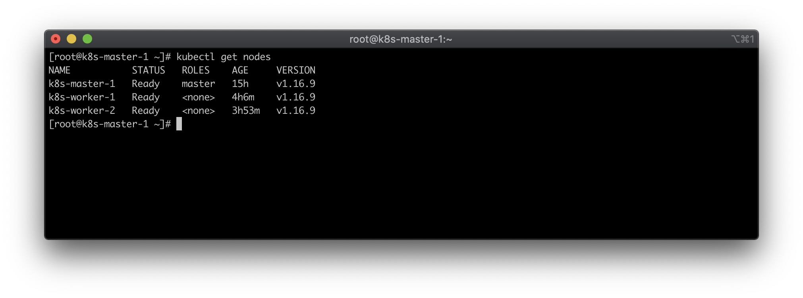
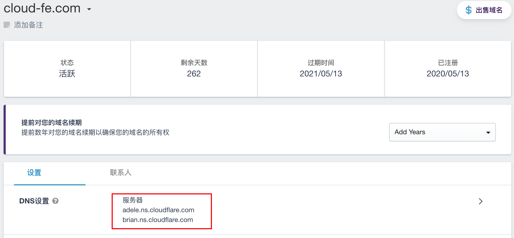
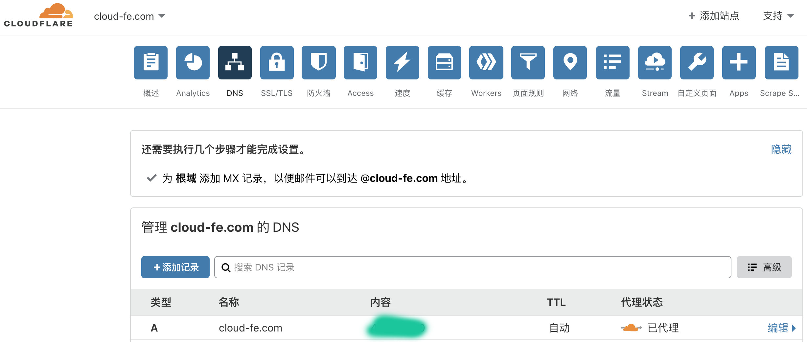
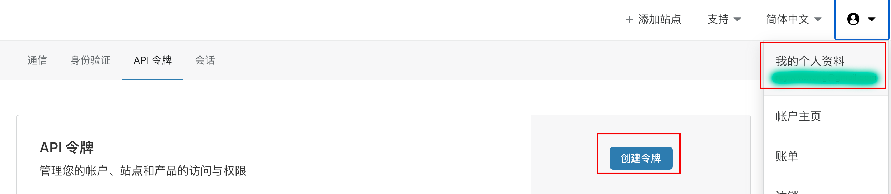
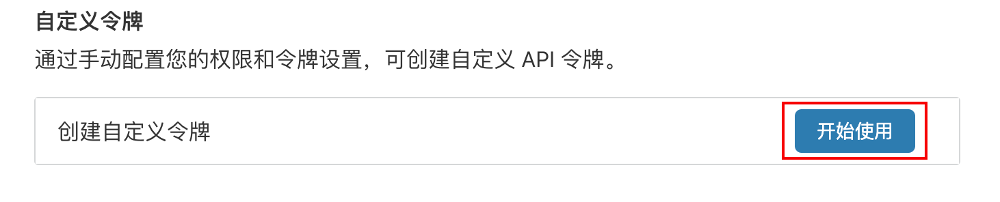
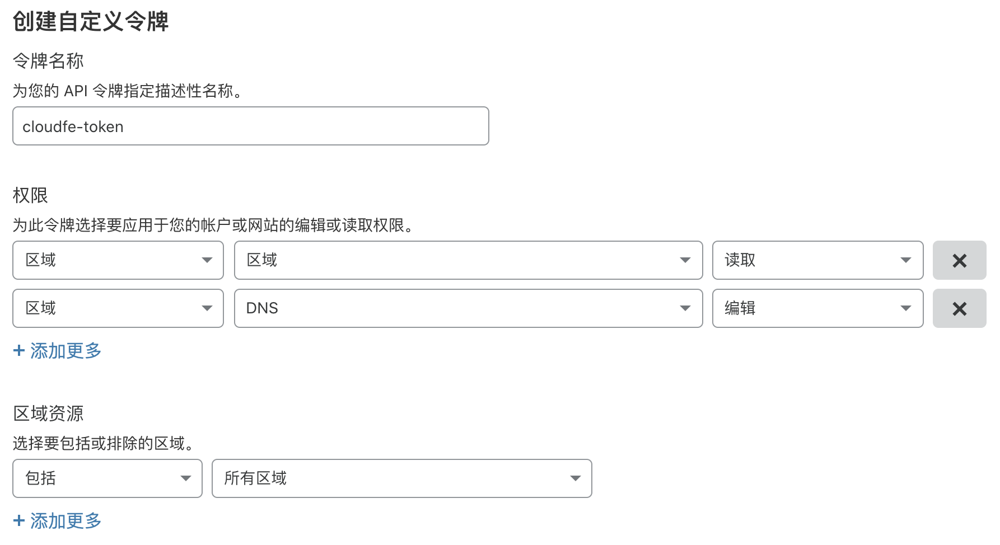
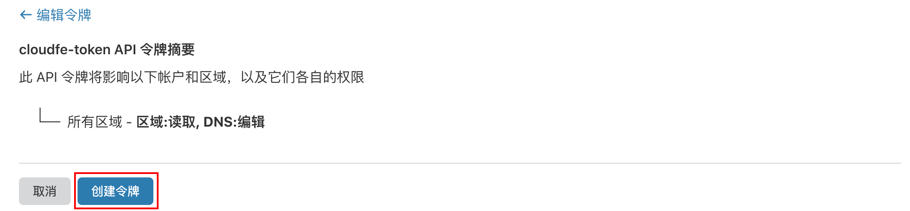
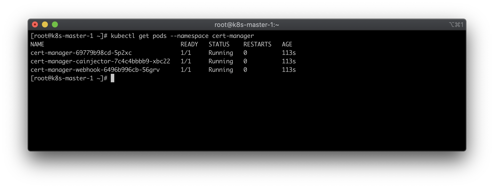
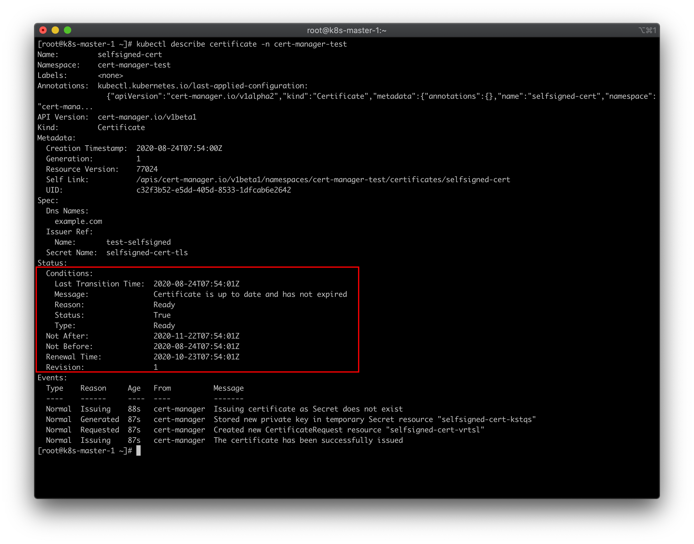
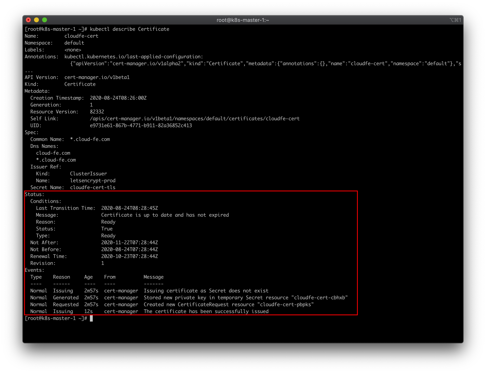

# 大前端时代，FEer 聊 12factor-App Go 微服务项目 Podinfo 之 K8S Cert-Manager 与 Let’s Encrypt 实战篇

## 介绍

### 这是一个系列

1. [大前端时代，使用容器探索开源的 Golang 微服务模板项目](https://juejin.im/post/6862964394834264072)
2. [大前端时代，FEer 聊 12factor-App Go 微服务项目 Podinfo 之开篇](https://juejin.im/post/6863349383438860302)
3. [大前端时代，FEer 聊 12factor-App Go 微服务项目 Podinfo 之 K8S 从 0 到 1 自建实战篇](https://juejin.im/post/6864385953360773128)

### Cert-Manager 是什么？

Cert-Manager 是一个云原生证书管理开源项目，用于在 Kubernetes 集群中提供 HTTPS 证书并自动续期。我们可以通过 Kubernetes Ingress 和 Let’s Encrypt 实现外部服务的自动化 HTTPS。

## 准备工作

### K8S 集群



### 域名

`为少` 的 [cloud-fe.com](http://cloud-fe.com) 域名是在 [dynadot](https://www.dynadot.com/) 申请的（城外）。



### 停靠 CloudFlare(你可能不需要)

[CloudFlare](https://cloudflare.com/)

因为`为少`的机器在 [Vultr](https://www.vultr.com/?ref=8663678-6G)，所以加速是非常必要的。



### letsencrypt 域名验证方式

* [HTTP-01 验证方式](https://letsencrypt.org/zh-cn/docs/challenge-types/#http-01-%E9%AA%8C%E8%AF%81%E6%96%B9%E5%BC%8F)
* [DNS-01 验证方式](https://letsencrypt.org/zh-cn/docs/challenge-types/#dns-01-%E9%AA%8C%E8%AF%81%E6%96%B9%E5%BC%8F)
* [TLS-SNI-01](https://letsencrypt.org/zh-cn/docs/challenge-types/#tls-sni-01)
* [TLS-ALPN-01](https://letsencrypt.org/zh-cn/docs/challenge-types/#tls-alpn-01)

这里选择 [DNS-01 验证方式](https://letsencrypt.org/zh-cn/docs/challenge-types/#dns-01-%E9%AA%8C%E8%AF%81%E6%96%B9%E5%BC%8F)

### CloudFlare API Token

CloudFlare 允许我们透過 API 的方式修改 DNS Record 从而通过 Let's Encrypt 的验证。这里，我将使用 CloudFlare 作为 Let's Encrypt 的 DNS 验证。

我们创建令牌：









在令牌创建成功页面，我们根据提示进行测试。

```sh
curl -X GET "https://api.cloudflare.com/client/v4/user/tokens/verify" \
     -H "Authorization: Bearer your-token" \
     -H "Content-Type:application/json"
## 成功则返回
# {"result":{"id":"e257639048a053c025772fa91f5ae253","status":"active"},"success":true,"errors":[],"messages":[{"code":10000,"message":"This API Token is valid and active","type":null}]}
```

## K8S 内部署 Cert-Manager

### Helm 的安装

```sh
wget https://get.helm.sh/helm-v3.2.1-linux-amd64.tar.gz
tar -zxvf helm-v3.2.1-linux-amd64.tar.gz
cp linux-amd64/helm /usr/bin/
```

### Helm 部署 Cert-Manager

```sh
kubectl create namespace cert-manager
helm repo add jetstack https://charts.jetstack.io
helm repo update

# Kubernetes 1.15+
kubectl apply --validate=false -f https://github.com/jetstack/cert-manager/releases/download/v0.16.0/cert-manager.crds.yaml

# Helm v3+
helm install \
  cert-manager jetstack/cert-manager \
  --namespace cert-manager \
  --version v0.16.0
```

### 验证安装

```sh
kubectl get pods --namespace cert-manager
```



### 创建 Issuer，测试 cert-manager-webhook

```sh
cat <<EOF > test-resources.yaml
apiVersion: v1
kind: Namespace
metadata:
  name: cert-manager-test
---
apiVersion: cert-manager.io/v1alpha2
kind: Issuer
metadata:
  name: test-selfsigned
  namespace: cert-manager-test
spec:
  selfSigned: {}
---
apiVersion: cert-manager.io/v1alpha2
kind: Certificate
metadata:
  name: selfsigned-cert
  namespace: cert-manager-test
spec:
  dnsNames:
    - example.com
  secretName: selfsigned-cert-tls
  issuerRef:
    name: test-selfsigned
EOF

kubectl apply -f test-resources.yaml
```

查看一下，有无问题：

```sh
kubectl describe certificate -n cert-manager-test
```



`Ready`，没有问题。

我们清除掉它：

```sh
kubectl delete -f test-resources.yaml
```

### 配置 secret

注意更改 `api-token`

```sh
cat > cloudflare-api-token-secret.yaml << EOF
apiVersion: v1
kind: Secret
metadata:
  name: cloudflare-api-token-secret
  namespace: cert-manager
type: Opaque
stringData:
  api-token: your-token

EOF
```

### 配置 ClusterIssue

注意更改 `email`

```sh
cat > cluster-issuer.yaml << EOF
apiVersion: cert-manager.io/v1alpha2
kind: ClusterIssuer
metadata:
  labels:
    name: letsencrypt-prod
  name: letsencrypt-prod
  namespace: cert-manager
spec:
  acme:
    server: https://acme-staging-v02.api.letsencrypt.org/directory
    privateKeySecretRef:
      name: letsencrypt-prod
    solvers:
    - dns01:
        cloudflare:
          email: your@gmail.com
          apiTokenSecretRef:
            name: cloudflare-api-token-secret
            key: api-token

EOF
```

### 配置 Certificate

```sh
cat > cloudfe-certificate.yaml << EOF
apiVersion: cert-manager.io/v1alpha2
kind: Certificate
metadata:
  name: cloudfe-cert
spec:
  secretName: cloudfe-cert-tls
  issuerRef:
    name: letsencrypt-prod
    kind: ClusterIssuer
  commonName: '*.cloud-fe.com'
  dnsNames:
  - cloud-fe.com
  - "*.cloud-fe.com"

EOF
```

### 应用配置

```sh
kubectl apply -f cloudflare-api-token-secret.yaml

kubectl apply -f cluster-issuer.yaml
```

### 手动签发泛域名证书

```sh
kubectl apply -f cloudfe-certificate.yaml
```

### 验证是否配置成功

等个一、两分钟，然后键入：
```sh
kubectl describe Certificate
```



看到没，完美 `Ready`。

为少现在做的一切基础工作，都是为了 `Podinfo` 项目上云。

这一节就到这里了，下一讲会和大家一起探讨下 `Ingress` 之 `Traefik`(云原生边缘路由) 。

## 参考 & 感谢

* [jetstack/cert-manager](https://github.com/jetstack/cert-manager)
* [https://cert-manager.io/docs/installation/kubernetes/](https://cert-manager.io/docs/installation/kubernetes/)
* [K8S 之 Cert-Manager 建置](http://phorum.study-area.org/index.php?topic=72631.msg345585)
* [NS1 + Kubernetes Cert Manager Integration](https://help.ns1.com/hc/en-us/articles/360044462853-NS1-Kubernetes-Cert-Manager-Integration)

这些文章同时也会同步在 `为少的博客` [黑客下午茶](https://hacker-linner.com/docs/about)。