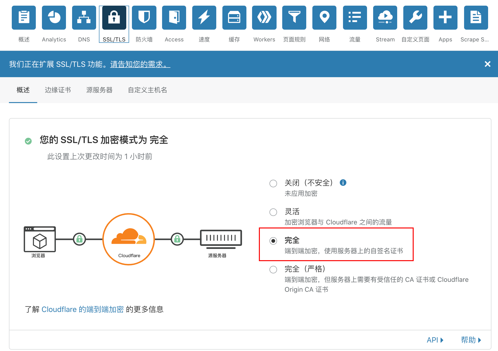
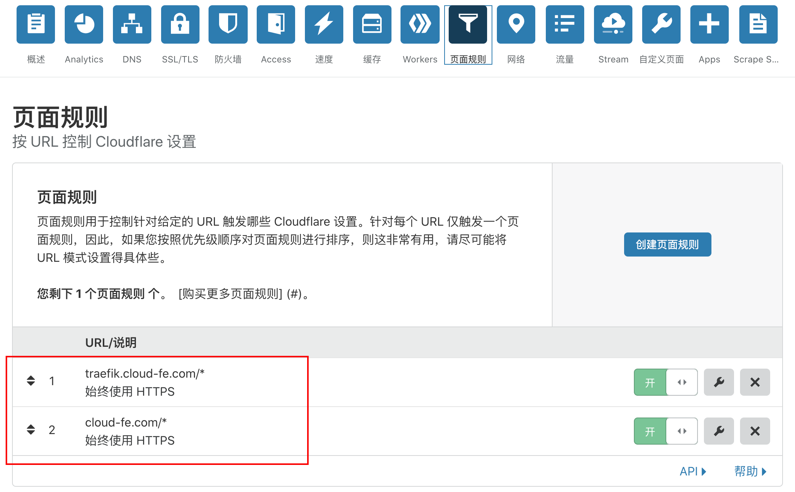
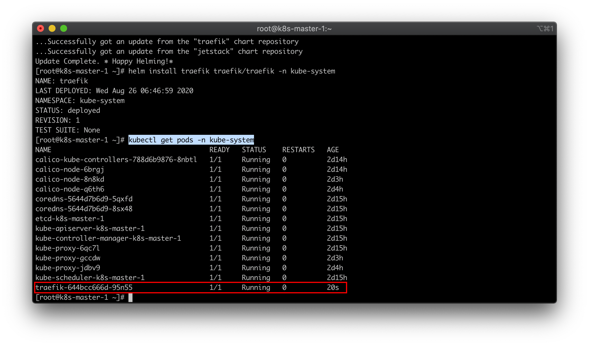
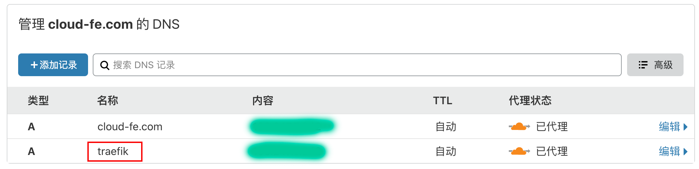
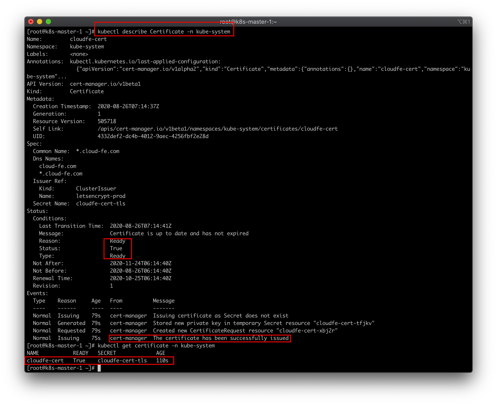
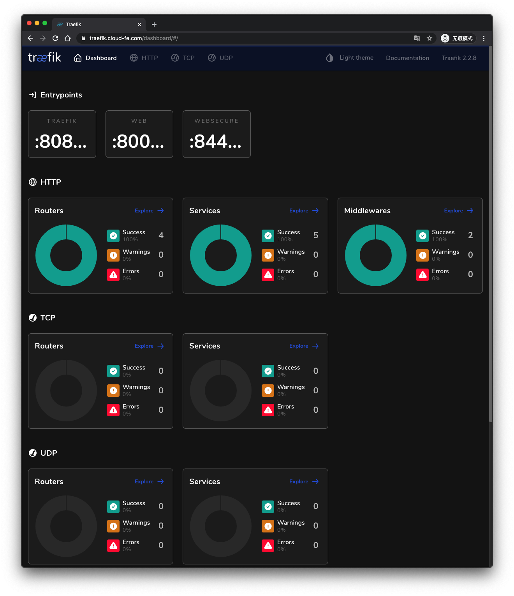
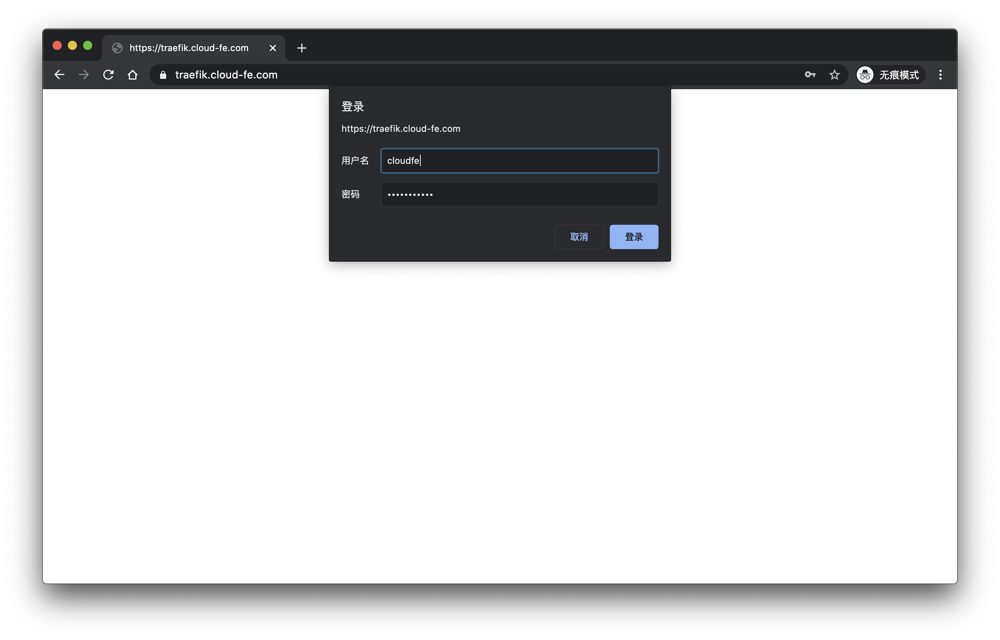

# 大前端时代，FEer 聊 12factor-App Go微服务项目 Podinfo 之 Traefik 和 K8S Ingress Controller 实战篇

## 介绍

### 这是一个系列

1. [大前端时代，使用容器探索开源的 Golang 微服务模板项目](https://juejin.im/post/6862964394834264072)
2. [大前端时代，FEer 聊 12factor-App Go 微服务项目 Podinfo 之开篇](https://juejin.im/post/6863349383438860302)
3. [大前端时代，FEer 聊 12factor-App Go 微服务项目 Podinfo 之 K8S 从 0 到 1 自建实战篇](https://juejin.im/post/6864385953360773128)
4. [大前端时代，FEer 聊 12factor-App Go 微服务项目 Podinfo 之 K8S Cert-Manager 与 Let’s Encrypt 实战](https://juejin.im/post/6864472044411879431)

### Traefik 是什么？

[Traefik, The Cloud Native Edge Router](https://containo.us/traefik/)

Traefik 是一种现代 HTTP 反向代理和负载均衡器，用于轻松部署微服务。

掘金上掘友[think123](https://juejin.im/user/3949101495886072)这篇文章对 Traefik 使用有不错的解释：[我为什么要选择traefik2做网关？](https://juejin.im/post/6844904088602148878)

## 准备工作

### Helm V3

确保你已经安装了 Helm V3，上一节已经介绍如何安装它 -> [Helm V3 的安装](https://juejin.im/post/6864472044411879431#heading-10)。

```sh
## 查看下版本号
helm version
# version.BuildInfo{Version:"v3.0.1", GitCommit:"7c22ef9ce89e0ebeb7125ba2ebf7d421f3e82ffa", GitTreeState:"clean", GoVersion:"go1.13.4"}
```

### Traefik v2 helm chart values.yaml

GitHub 仓库：[traefik-helm-chart](https://github.com/containous/traefik-helm-chart)

它的 Chart [Values.yaml](https://github.com/containous/traefik-helm-chart/blob/master/traefik/values.yaml)，有很多细节的配置，大家可以自行探索。`为少` 后面也可能出篇文章仔细说说（估计没个万把字讲不明白，微服务相关的东西太多了）

这里我简单配置一下：

`traefik-v2-chart-values.yaml`

```yaml
service:
  type: ClusterIP

ingressRoute:
  dashboard:
    enabled: false

nodeSelector:
  kubernetes.io/hostname: k8s-master-1

ports:
  web:
    hostPort: 80
  websecure:
    hostPort: 443
  traefik:
    port: 8080
    hostPort: 8080
    exposedPort: 8080
    expose: true

additionalArguments:
  - "--serversTransport.insecureSkipVerify=true"
  - "--api.insecure=true"
  - "--api.dashboard=true"
```

### CloudFlare 配置(你可能不需要)

配置 `SSL/TLS` 加密模式：



配置`页面规则`



### 添加 Traefik v2 helm chart

```sh
helm repo add traefik https://containous.github.io/traefik-helm-chart
helm repo update # 更新下仓库
```

### helm v3 部署 Traefik v2

```sh
helm install traefik traefik/traefik -f traefik-v2-chart-values.yaml -n kube-system
# helm uninstall traefik -n kube-system # 卸载 traefik
```



OK，`Ready`!!!

## 部署 Traefik 面板

### 解析域名

这里 `为少` 将 `traefik.cloud-fe.com` 解析到我的 K8S 集群上。

上一讲，`为少` 已经将域名停靠在了 `cloudflare` 上了，所以：



### kube-system 下签发证书

上一节，为少有详细讲： [配置 Certificate](https://juejin.im/post/6864472044411879431#heading-18)

所以：
```sh
kubectl apply -f cloudfe-certificate.yaml -n kube-system
```

### kube-system 下查看证书
```sh
kubectl describe Certificate -n kube-system
```



### 部署面板 Ingress Route

`traefik-dashboard-ingress-route.yaml` 如下：

```yaml
apiVersion: traefik.containo.us/v1alpha1
kind: IngressRoute
metadata:
  name: traefik-dashboard-route
spec:
  entryPoints:
    - websecure
  tls:
    secretName: cloudfe-cert-tls
  routes:
    - match: Host(`traefik.cloud-fe.com`)
      kind: Rule
      services:
        - name: traefik
          port: 8080
```

应用配置

```sh
kubectl apply -f traefik-dashboard-ingress-route.yaml -n kube-system
# kubectl delete -f traefik-dashboard-ingress-route.yaml -n kube-system
```

### 访问面板

[https://traefik.cloud-fe.com](https://traefik.cloud-fe.com/)



完美部署。

## 使用 Traefik 中间件 BasicAuth 设置面板访问权限

详细文档，请查阅 [BasicAuth](https://docs.traefik.io/middlewares/basicauth/)


### 配置 Secret

密码必须是一个 `MD5`，`SHA1` 或者 `BCrypt` 的哈希值。

这里我`比如说`是使用 `htpasswd` 产生一个用户名是 `cloudfe`，密码为 `cloudfe123` 的哈希值。

```sh
htpasswd -nb cloudfe cloudfe123
# cloudfe:$apr1$ETFHyV73$hzz88wP7TNSWhCDByD1VT0
```

`traefik-authsecret.yaml` 如下：

```yaml
apiVersion: v1
kind: Secret
metadata:
  name: traefik-authsecret
type: Opaque
stringData:
  users: cloudfe:$apr1$ETFHyV73$hzz88wP7TNSWhCDByD1VT0
```

### 配置 BasicAuth 中间件

`traefik-basic-auth.yaml` 如下：

```yaml
apiVersion: traefik.containo.us/v1alpha1
kind: Middleware
metadata:
  name: traefik-basic-auth
spec:
  basicAuth:
    secret: traefik-authsecret
```

### 重新配置 Ingress Route

`traefik-dashboard-ingress-route.yaml` 如下：

```yaml
apiVersion: traefik.containo.us/v1alpha1
kind: IngressRoute
metadata:
  name: traefik-dashboard-route
spec:
  entryPoints:
    - websecure
  tls:
    secretName: cloudfe-cert-tls
  routes:
    - match: Host(`traefik.cloud-fe.com`)
      kind: Rule
      services:
        - name: traefik
          port: 8080
      middlewares:
        - name: traefik-basic-auth
```

### 应用配置

```sh
kubectl apply -f traefik-authsecret.yaml -n kube-system
kubectl apply -f traefik-basic-auth.yaml -n kube-system
kubectl apply -f traefik-dashboard-ingress-route.yaml -n kube-system
```

### 重新访问面板

[https://traefik.cloud-fe.com](https://traefik.cloud-fe.com/)

看到没，验证通过才能访问。




## 参考 & 感谢

* [Traefik 官方文档](https://docs.traefik.io/)
* [Traefik 中文文档](https://www.qikqiak.com/traefik-book/)
* [traefik-helm-chart](https://github.com/containous/traefik-helm-chart)
* [我为什么要选择traefik2做网关？](https://juejin.im/post/6844904088602148878)
* [一文搞懂 Traefik2.1 的使用](https://www.qikqiak.com/post/traefik-2.1-101/)

这些文章同时也会同步在 `为少的博客` [黑客下午茶](https://hacker-linner.com/docs/about)。
