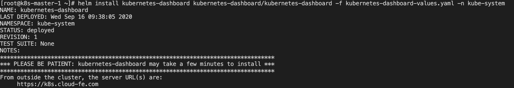
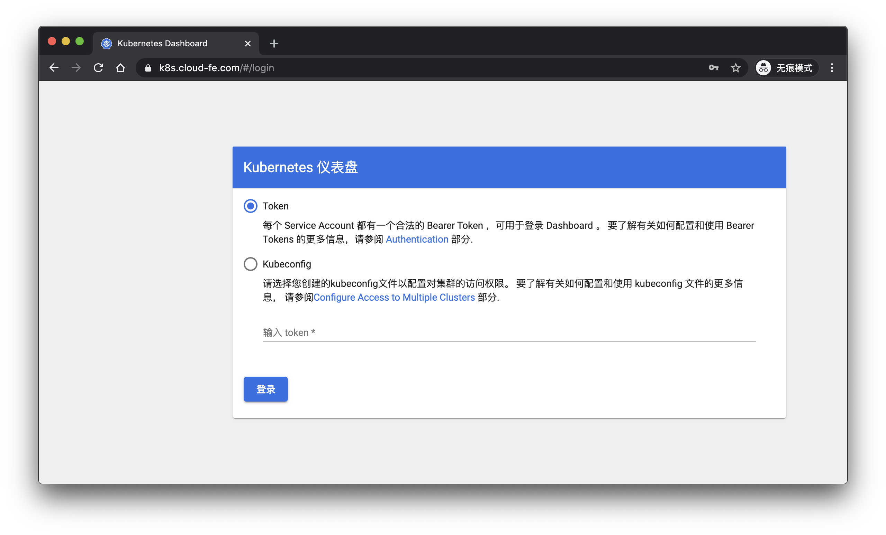
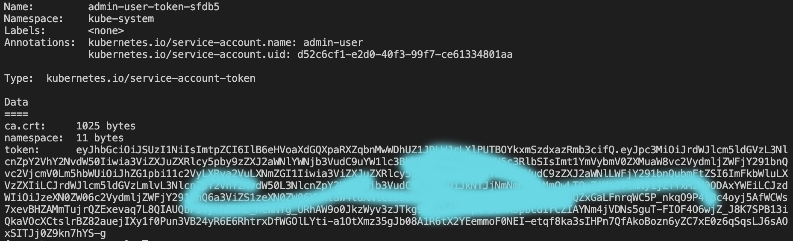
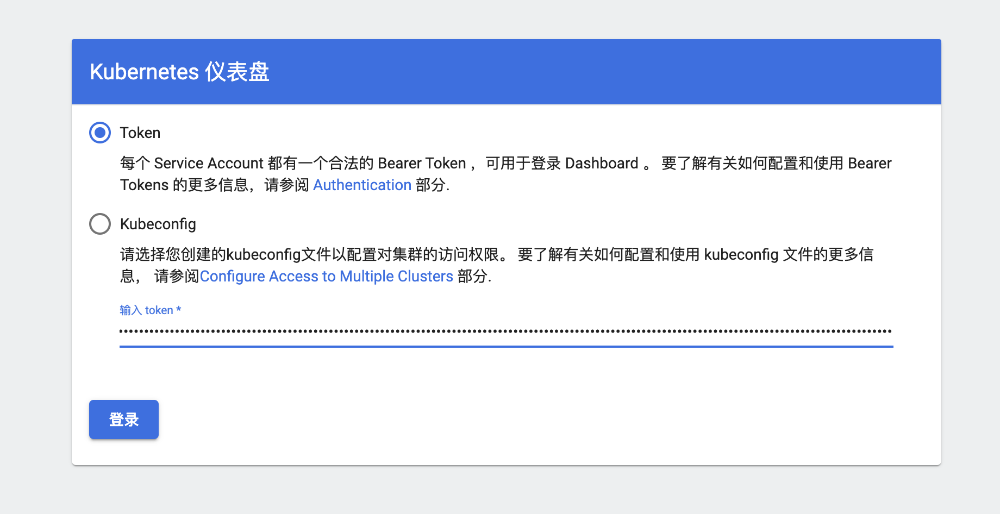
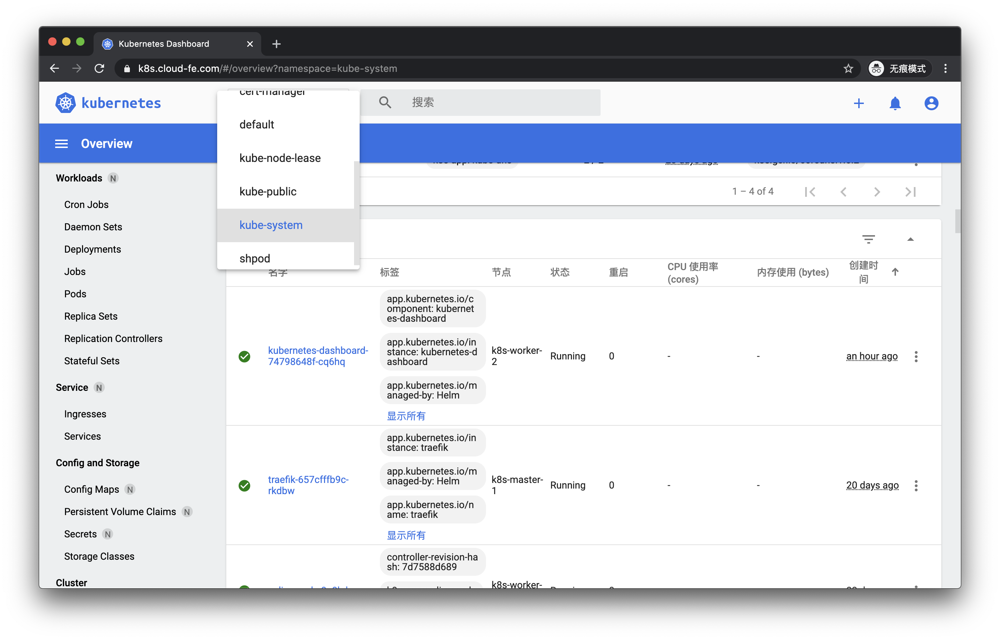

# 大前端时代，FEer 聊 12factor-App Go微服务项目 Podinfo 之 Helm 3 部署 kubernetes-dashboard 实战篇

## 介绍

### 这是一个系列

1. [大前端时代，使用容器探索开源的 Golang 微服务模板项目](https://juejin.im/post/6862964394834264072)
2. [大前端时代，FEer 聊 12factor-App Go 微服务项目 Podinfo 之开篇](https://juejin.im/post/6863349383438860302)
3. [大前端时代，FEer 聊 12factor-App Go 微服务项目 Podinfo 之 K8S 从 0 到 1 自建实战篇](https://juejin.im/post/6864385953360773128)
4. [大前端时代，FEer 聊 12factor-App Go 微服务项目 Podinfo 之 K8S Cert-Manager 与 Let’s Encrypt 实战](https://juejin.im/post/6864472044411879431)
5. [大前端时代，FEer 聊 12factor-App Go微服务项目 Podinfo 之 Helm 3 部署 Traefik 2 实战篇](https://juejin.im/post/6865339029072642056)

### 项目地址

* [官方 Podinfo](https://github.com/stefanprodan/podinfo)
* [笔者修改过的 Podinfo](https://github.com/Hacker-Linner/podinfo)

### kubernetes-dashboard 是什么？

Kubernetes仪表板是用于Kubernetes集群的基于web的通用UI。它允许用户管理集群中运行的应用程序并对它们进行故障排除，还可以管理集群本身。

## 上云☁️

### Helm V3

[Helm V3 的安装](https://juejin.im/post/6864472044411879431#heading-10)。

### 域名

这里是 [https://k8s.cloud-fe.com/](https://k8s.cloud-fe.com/)，已解析到集群。

### Chart Values.yaml

[kubernetes-dashboard helm hub](https://hub.helm.sh/charts/k8s-dashboard/kubernetes-dashboard)：里面的 `Configuration` 一节有详细的配置项，大家根据需要来。

`kubernetes-dashboard-values.yaml`：

```yaml
ingress:
  enabled: true
  annotations:
    ingress.kubernetes.io/ssl-redirect: "true"
    ingress.kubernetes.io/proxy-body-size: "0"
    kubernetes.io/ingress.class: "traefik"
    traefik.ingress.kubernetes.io/router.tls: "true"
    traefik.ingress.kubernetes.io/router.entrypoints: websecure
  hosts:
    - k8s.cloud-fe.com
  tls:
    - secretName: cloudfe-cert-tls
      hosts:
        - k8s.cloud-fe.com
```

### 安装

```sh
# 添加 kubernetes-dashboard 仓库
helm repo add kubernetes-dashboard https://kubernetes.github.io/dashboard/

# 我这里直接把它放在 `kube-system` 名称空间，它的 release 名字是 `kubernetes-dashboard`
helm install kubernetes-dashboard kubernetes-dashboard/kubernetes-dashboard -f kubernetes-dashboard-values.yaml -n kube-system 
```

一切顺利会出现如下提示：



我们访问下 [https://k8s.cloud-fe.com/](https://k8s.cloud-fe.com/) ：



但是，现在还没有办法进入管理面板。我们需要创建一个身份验证 Token(RBAC：`基于角色的访问控制`)，然后用它来登录。

### 创建 Service Account

在 `kube-system` 命名空间中创建一个名为 `admin-user` 的 Service Account

```sh
cat <<EOF | kubectl apply -f -
apiVersion: v1
kind: ServiceAccount
metadata:
  name: admin-user
  namespace: kube-system
EOF
```

### 创建 ClusterRoleBinding

在大多数情况下，在使用 `kops`、`kubeadm` 或任何其他流行工具配置集群之后，集群中已经存在`ClusterRole` `cluster-admin`。我们可以使用它并仅为我们的 `ServiceAccount` 创建`ClusterRoleBinding`。如果它不存在，那么您需要首先创建此角色并手动授予所需的特权。

```sh
cat <<EOF | kubectl apply -f -
apiVersion: rbac.authorization.k8s.io/v1
kind: ClusterRoleBinding
metadata:
  name: admin-user
roleRef:
  apiGroup: rbac.authorization.k8s.io
  kind: ClusterRole
  name: cluster-admin
subjects:
- kind: ServiceAccount
  name: admin-user
  namespace: kube-system
EOF
```

### 获取 Bearer Token

```sh
kubectl -n kube-system describe secret $(kubectl -n kube-system get secret | grep admin-user | awk '{print $1}')
```

正常会如下所示：



我们复制 `token`，然后登录进去：





完美؏؏☝ᖗ乛◡乛ᖘ☝؏؏!